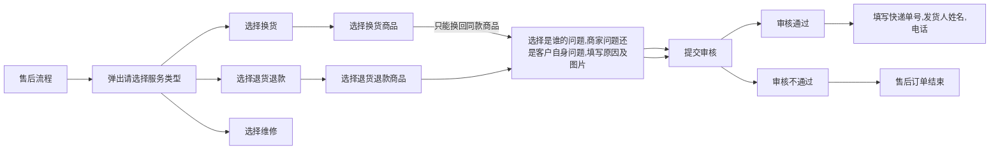

##### 遗留问题：


```
已完成
1检查到了订单签收状态 路由回调他会自己设置
2.不应该把未退完的商品禁了
如果没退完的商品应该显示正在有几件商品正在审核中， 全部商品在审核中就应该显示，退货退款审核中
3.把 after表中 > after_goods 字段 > whoques 字段 && cause 字段， 放到after表中

```


```
未完成

退货退款成功 的商品 购买数量要减掉

通过审核后5天内自动取消

```
