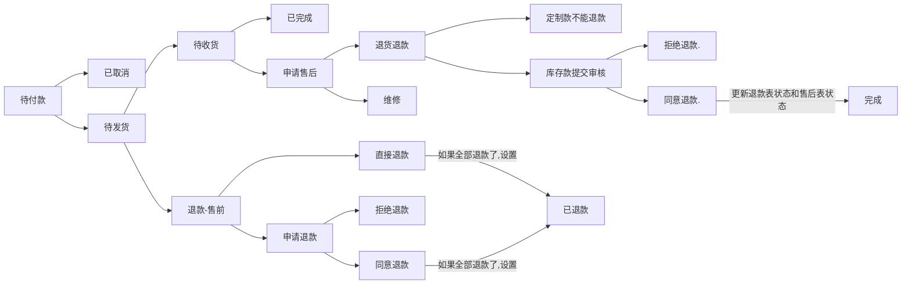

# 珠宝项目

```


   014
   01345
    //【--refund--】  status_code 状态码：      0：审核中，   1：审核通过-退款中，   2：审核不通过，  3：审核通过-退款完成   4：退款中，   5：退款完成，  6：退款失败
    
    
      
      
      
   ---------------------------------------------------------------  after  ----------------------------------------------------------------------------------


    //【--order--】 apply_after_goods     【1退款退款】：   0：退货退款审核中    1：审核通过，请填写单号    2：审核不通过    3：运输中   4：仓库已签收   5：仓库签收失败                                                                 6：验收成功，退款中     7：验收失败，退货退款不成功     8：退货退款成功
    
              
                   
    																013468
    //【--after--】 status_code 状态码：	 【1退款退款】：   0：退货退款审核中    1：审核通过，请填写单号    2：审核不通过    3：运输中   4：仓库已签收   5：仓库签收失败                                                                  6：验收成功，退款中     7：验收失败，退货退款不成功     8：退货退款成功
										 
										 【2维修】：       11：维修审核中
 
 
    //订单状态：   0-待付款   1-已取消   2-待发货   3-待收货   5-已完成    6-退款中   7-退款失败    8-已退款  

    
    
 
```

##### 	订单状态：




refund_type = 1


--------------------------------------------------------------

order表中orders字段中的对象增加  


 ✓3 // 已退款-库存款  refund_user_qua_finish_inventory    

 ✓3 // 已退款-定制款  refund_user_qua_finish_customize

✓1 //退款审核中-定制款  refund_user_qua_auditin

✓1 //退款中-库存款  refund_user_qua_refundin

✓2 //审核通过,退款中-定制款  refund_user_qua_auditpassrefundin


✓1  //退货退款审核中 after_user_qua_refundreturn_auditin   

✓2  //审核通过,退货退款中 after_user_qua_refundreturn_auditpassrefundin   

✓3  //已退货退款-库存款 after_user_qua_refundreturn_finish_inventory   


refund -> agreerefund


<div class="goods-refund-info">
    <p>此商品有1件 退款中</p>
    <p>此商品有1件 退款审核中</p>
    <p>此商品有1件 审核通过,退款中</p>
    <p>此商品有1件 已退款</p>
    <p>此商品 已退款</p>
    <p></p>
    <p>此商品有1件 退货退款审核中</p>
    <p>此商品有1件 审核通过,退货退款中</p>
    <p>此商品有1件 已退货退款</p>
    <p>此商品已退货退款</p>
</div>


<div class="order-price">
    <p>实际支付<strong>0.01元</strong></p>
    <p>退款<strong>0.01元</strong></p> 
    <p>原支付<strong>0.02元</strong></p>
    <p>在线</p>
</div>	


<div class="order-price">  <p>原支付<strong>0.02元</strong></p>
    <p>- 退款<strong>0.01元</strong></p> 
    <p>实际支付<strong>0.01元</strong></p><p>在线</p></div>